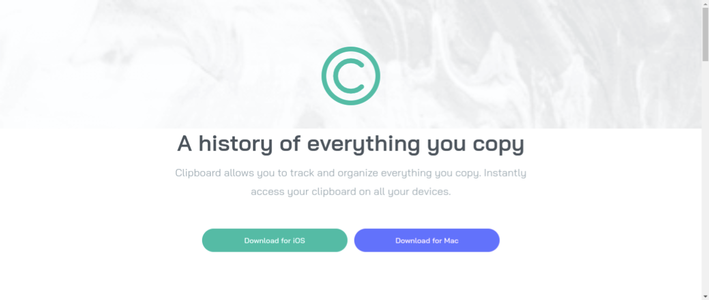

# Frontend Mentor - Clipboard landing page solution

This is a solution to the [Clipboard landing page challenge on Frontend Mentor](https://www.frontendmentor.io/challenges/clipboard-landing-page-5cc9bccd6c4c91111378ecb9). Frontend Mentor challenges help you improve your coding skills by building realistic projects.

## Table of contents

- [Overview](#overview)
  - [The challenge](#the-challenge)
  - [Screenshot](#screenshot)
  - [Links](#links)
- [My process](#my-process)
  - [Built with](#built-with)
  - [What I learned](#what-i-learned)
  - [Continued development](#continued-development)
  - [Useful resources](#useful-resources)
- [Author](#author)

## Overview

This project involved using flexbox, grid, pseudoclasses, combinator selectors and even custom values for code reuse.

### The challenge

Users should be able to:

- View the optimal layout for the site depending on their device's screen size
- See hover states for all interactive elements on the page

### Screenshot

### Links

- Solution URL: [GitHub](https://github.com/ronitzdev/clipboard-landing-page)
- Live Site URL: [Live](https://clipboard-landing-ronitzdev.netlify.app/)

## My process

### Built with

- Semantic HTML5 markup
- CSS custom properties
- Flexbox
- CSS Grid
- Mobile-first workflow

### What I learned

This landing page was a good challenge, it helped me to consider mobile, tablet and desktop scenarios, both the issue of breakpoints to adapt the content and consequent changes to increase or decrease the size of the web.

### Continued development

I will continue to strive to make a much cleaner code, with good practices and more optimized to different devices. There will always be things to polish to get the best out of us as developers.

### Useful resources

- [Icons](https://boxicons.com/) - Quality icons for social networks and more.

## Author

- Website - [GitHub](https://github.com/ronitzdev)
- Frontend Mentor - [@ronitzdev](https://github.com/ronitzdev)
